# deeptime

<!-- badges: start -->
[](https://github.com/willgearty/deeptime/actions)
[](https://codecov.io/gh/willgearty/deeptime)
[](https://zenodo.org/badge/latestdoi/152502088)
[](https://CRAN.R-project.org/package=deeptime)
[](https://cran.r-project.org/package=deeptime)
<!-- badges: end -->

## Overview
Extends the functionality of other plotting packages like
`ggplot2` and `lattice` to help facilitate the plotting of data over long time
intervals, including, but not limited to, geological, evolutionary, and ecological
data. The primary goal of 'deeptime' is to enable users to add highly customizable
timescales to their visualizations. Other functions are also included to assist
with other areas of deep time visualization.

## Installation
```r
# get the stable version from CRAN
install.packages("deeptime")

# or get the development version from github
# install.packages("devtools")
devtools::install_github("willgearty/deeptime")
```

## Usage

### Load packages
```r
library(deeptime)
library(ggplot2)
```

The main function of `deeptime` is `coord_geo()`, which functions just like `coord_trans()` from `ggplot2`.
You can use this function to add highly customizable timescales to a wide variety of ggplots.

### Default scale on bottom axis
```r
library(divDyn)
library(tidyverse)
data(corals)
# this is not a proper diversity curve but it gets the point across
coral_div <- corals %>% filter(stage != "") %>%
  group_by(stage) %>%
  summarise(n = n()) %>%
  mutate(stage_age = (stages$max_age[match(stage, stages$name)] + stages$min_age[match(stage, stages$name)])/2)
ggplot(coral_div) +
  geom_line(aes(x = stage_age, y = n)) +
  scale_x_reverse("Age (Ma)") +
  ylab("Coral Genera") +
  coord_geo(xlim = c(250, 0), ylim = c(0, 1700)) +
  theme_classic()
```

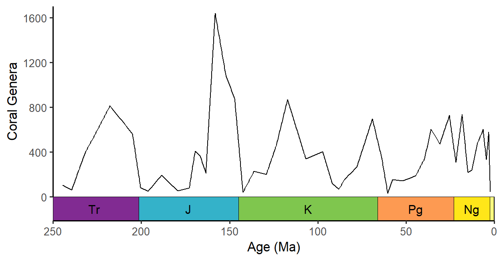

### Scale on left axis
```r
library(gsloid)
ggplot(lisiecki2005) +
  geom_line(aes(x = d18O, y = Time/1000), orientation = "y") +
  scale_y_reverse("Time (Ma)") +
  scale_x_reverse() +
  coord_geo(dat = "Geomagnetic Polarity Chron", xlim = c(6,2), ylim = c(6,0), pos = "left", rot = 90) +
  theme_classic()
```

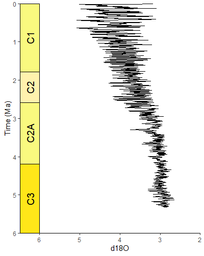

### Stack multiple scales (e.g. periods and eras)
Specify multiple scales by giving a list for `pos`. Scales are added from the inside to the outside. Other arguments can be lists or single values (either of which will be recycled if necessary).
```r
# uses the coral diversity data from above
ggplot(coral_div) +
  geom_line(aes(x = stage_age, y = n)) +
  scale_x_reverse("Age (Ma)") +
  ylab("Coral Genera") +
  coord_geo(dat = list("periods", "eras"), xlim = c(250, 0), ylim = c(0, 1700),
            pos = list("b", "b"), abbrv = list(TRUE, FALSE)) +
  theme_classic()
```

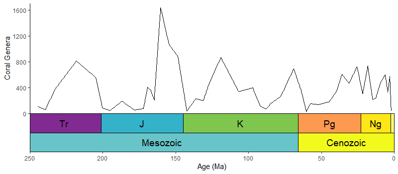

### Show intervals from different scales (e.g. Geochrons vs. Foram biozones)
```r
# uses the oxygen isotope data from above
ggplot(lisiecki2005) +
  geom_line(aes(x = d18O, y = Time/1000), orientation = "y") +
  scale_y_reverse("Time (Ma)") +
  scale_x_reverse() +
  coord_geo(dat = list("Geomagnetic Polarity Chron", "Planktic foraminiferal Primary Biozones"),
            xlim = c(6,2), ylim = c(5.5,0), pos = list("l", "r"), rot = 90, skip = "PL4", size = list(5, 4)) +
  theme_classic()
```

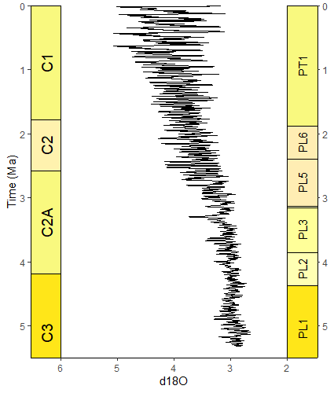

### Scale on faceted plot
You can change on which facets the time scale is plotted by changing the `scales` argument in `facet_wrap()`.
```r
# uses the coral occurrence data from above
coral_div_diet <- corals %>% filter(stage != "") %>%
  group_by(diet, stage) %>%
  summarise(n = n()) %>%
  mutate(stage_age = (stages$max_age[match(stage, stages$name)] + stages$min_age[match(stage, stages$name)])/2)

ggplot(coral_div_diet) +
  geom_line(aes(x = stage_age, y = n)) +
  scale_x_reverse("Age (Ma)") +
  ylab("Coral Genera") +
  coord_geo(xlim = c(250, 0)) +
  theme_classic() +
  facet_wrap(~diet, nrow = 3)
```

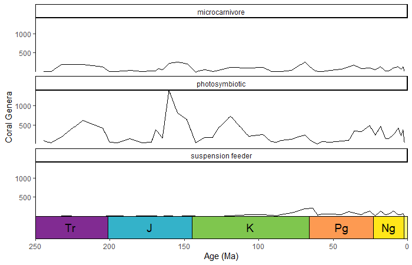

### Scale on discrete axis
`coord_geo()` will automatically detect if your axis is discrete. The categories of the discrete axis
(which can be reordered using the `limits` argument of `scale_[x/y]_discrete()`) should match the `name`
column of the timescale data (`dat`). You can use the arguments of `theme()` and `scale_[x/y]_discrete()`
to optionally remove the labels and tick marks.
```r
# uses the coral occurrence data from above
coral_div_dis <- corals %>% filter(period != "") %>%
  group_by(diet, period) %>%
  summarise(n = n()) %>%
  mutate(period_age = (periods$max_age[match(period, periods$name)] + periods$min_age[match(period, periods$name)])/2) %>%
  arrange(-period_age)

ggplot(coral_div_dis) +
  geom_col(aes(x = period, y = n, fill = diet)) +
  scale_x_discrete("Period", limits = unique(coral_div_dis$period), labels = NULL, expand = expansion(add = .5)) +
  scale_y_continuous(expand = c(0,0)) +
  scale_fill_viridis_d() +
  ylab("Coral Genera") +
  coord_geo(expand = TRUE, skip = NULL, abbrv = FALSE) +
  theme_classic() +
  theme(axis.ticks.length.x = unit(0, "lines"))
```

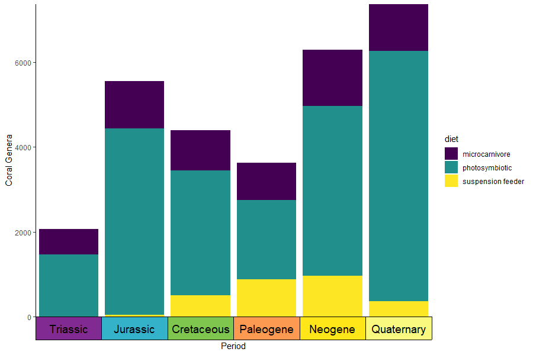

### Custom discrete scale
You can also supply your own pre-discretized scale data by setting the `dat_is_discrete` parameter to `TRUE`.
You can even have one scale with auto-discretized ages and one scale with pre-discretized ages.

```r
eras_custom <- data.frame(name = c("Mesozoic", "Cenozoic"), max_age = c(0.5, 3.5), min_age = c(3.5, 6.5), color = c("#67C5CA", "#F2F91D"))

ggplot(coral_div_dis) +
  geom_col(aes(x = period, y = n, fill = diet)) +
  scale_x_discrete(NULL, limits = unique(coral_div_dis$period), labels = NULL, expand = expansion(add = .5)) +
  scale_y_continuous(expand = c(0,0)) +
  scale_fill_viridis_d() +
  ylab("Coral Genera") +
  coord_geo(dat = list("periods", eras_custom), pos = c("b", "b"), expand = TRUE, skip = NULL, abbrv = FALSE, dat_is_discrete = list(FALSE, TRUE)) +
  theme_classic() +
  theme(axis.ticks.length.x = unit(0, "lines"))
```

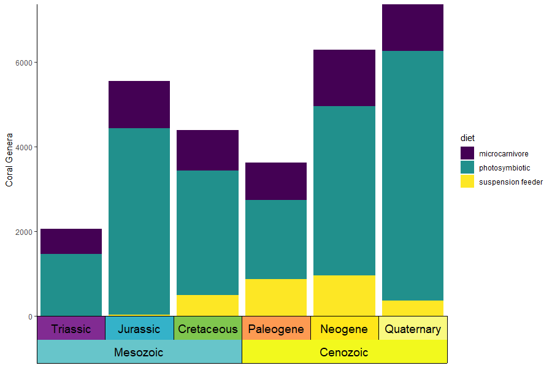

### Resize labels to fit inside interval rectangles
`coord_geo()` can use the [ggfittext package](https://wilkox.org/ggfittext/index.html) to resize labels.
This can be enabled by setting `size` to `"auto"`. Additional arguments can be passed to `geom_fit_text()`
as a list using the `fittext_args` argument.

```r
ggplot(coral_div) +
  geom_line(aes(x = stage_age, y = n)) +
  scale_x_reverse("Age (Ma)") +
  ylab("Coral Genera") +
  coord_geo(dat = "periods", xlim = c(250, 0), ylim = c(0, 1700),
            abbrv = FALSE, size = "auto", fittext_args = list(size = 20)) +
  theme_classic()
```

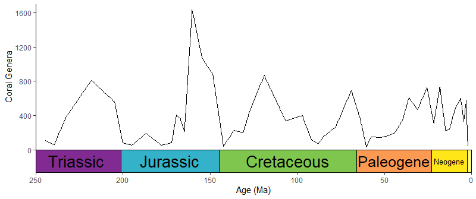

### Add scale to a phylogeny
```r
library(phytools)
library(ggtree)
data(mammal.tree)
p <- ggtree(mammal.tree) +
  coord_geo(xlim = c(-75,0), ylim = c(-2,Ntip(mammal.tree)), neg = TRUE, abbrv = FALSE) +
  scale_x_continuous(breaks=seq(-80,0,20), labels=abs(seq(-80,0,20))) +
  theme_tree2()
revts(p)
```


### Add scale to a phylogeny with only fossil taxa
```r
library(phytools)
library(ggtree)
library(paleotree)
data(RaiaCopesRule)
ggtree(ceratopsianTreeRaia, position = position_nudge(x = -ceratopsianTreeRaia$root.time)) +
  coord_geo(xlim = c(-163.5,-66), ylim = c(-2,Ntip(ceratopsianTreeRaia)), pos = list("bottom", "bottom"),
            skip = c("Paleocene", "Middle Jurassic"), dat = list("epochs", "periods"), abbrv = FALSE,
            size = list(4,5), neg = TRUE, center_end_labels = TRUE) +
  scale_x_continuous(breaks = -rev(epochs$max_age), labels = rev(epochs$max_age)) +
  theme_tree2() +
  theme(plot.margin = margin(7,11,7,11))
```


### Combine plots with timescales and plots without timescales
```r
library(paleotree)
data(RaiaCopesRule)
p1 <- ggplot(ammoniteTraitsRaia) +
  geom_point(aes(x = Log_D, y = FD)) +
  labs(x = "Body size", y = "Suture complexity") +
  theme_classic()

p2 <- ggplot(ammoniteTraitsRaia) +
  geom_point(aes(x = Log_D, y = log_dur)) +
  labs(x = "Body size", y = "Stratigraphic duration (myr)") +
  theme_classic()

p3 <- ggtree(ammoniteTreeRaia, position = position_nudge(x = -ammoniteTreeRaia$root.time)) +
  coord_geo(xlim = c(-415,-66), ylim = c(-2,Ntip(ammoniteTreeRaia)), pos = "bottom",
            size = 4, abbrv = FALSE, neg = TRUE) +
  scale_x_continuous(breaks = seq(-425, -50, 25), labels = -seq(-425, -50, 25)) +
  theme_tree2() +
  theme(plot.margin = margin(7,11,7,11))

ggarrange2(ggarrange2(p1, p2, widths = c(2,1), draw = FALSE), p3, nrow = 2, heights = c(1,2))
```

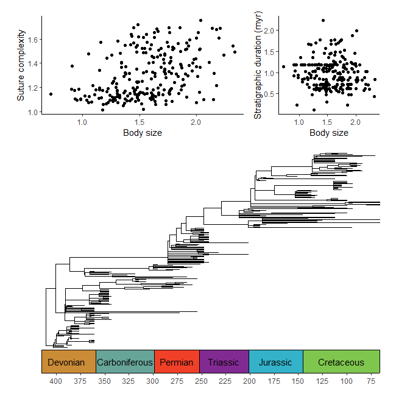

### Plot disparity through time
#### With ggplot
```r
#make transformer
library(ggforce)
trans <- linear_trans(shear(.5, 0))

library(dispRity)
data(demo_data)
# prepare data to be plotted
crinoids <- as.data.frame(demo_data$wright$matrix[[1]][, 1:2])
crinoids$time <- "before extinction"
crinoids$time[demo_data$wright$subsets$after$elements] <- "after extinction"

square <- data.frame(V1 = c(-.6, -.6, .6, .6), V2 = c(-.4, .4, .4, -.4))

# plot data normally
ggplot() +
  geom_segment(data = data.frame(x = -.6, y = seq(-.4, .4,.2), xend = .6, yend = seq(-0.4, .4, .2)),
               aes(x = x, y = y, xend = xend, yend=yend), linetype = "dashed", color = "grey") +
  geom_segment(data = data.frame(x = seq(-.6, .6, .2), y = -.4, xend = seq(-.6, .6, .2), yend = .4),
               aes(x = x, y = y, xend = xend, yend=yend), linetype = "dashed", color = "grey") +
  geom_polygon(data = square, aes(x = V1, y = V2), fill = NA, color = "black") +
  geom_point(data = crinoids, aes(x = V1, y = V2), color = 'black') +
  coord_cartesian(expand = FALSE) +
  labs(x = "PCO1", y = "PCO2") +
  theme_classic() +
  facet_wrap(~time, ncol = 1, strip.position = "right") +
  theme(panel.spacing = unit(1, "lines"), panel.background = element_blank())

# plot data with transformation
ggplot() +
  geom_segment(data = data.frame(x = -.6, y = seq(-.4, .4,.2), xend = .6, yend = seq(-0.4, .4, .2)),
               aes(x = x, y = y, xend = xend, yend=yend), linetype = "dashed", color = "grey") +
  geom_segment(data = data.frame(x = seq(-.6, .6, .2), y = -.4, xend = seq(-.6, .6, .2), yend = .4),
               aes(x = x, y = y, xend = xend, yend=yend), linetype = "dashed", color = "grey") +
  geom_polygon(data = square, aes(x = V1, y = V2), fill = NA, color = "black") +
  geom_point(data = crinoids, aes(x = V1, y = V2), color = 'black') +
  coord_trans_xy(trans = trans, expand = FALSE) +
  labs(x = "PCO1", y = "PCO2") +
  theme_classic() +
  facet_wrap(~time, ncol = 1, strip.position = "right") +
  theme(panel.spacing = unit(1, "lines"), panel.background = element_blank())
```

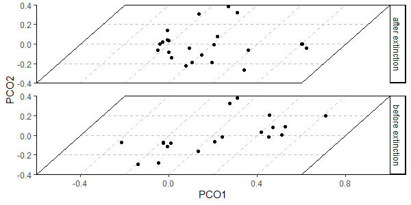

#### With base R/lattice
```r
# use same data as above
# plot data
crinoids$time <- factor(crinoids$time)
disparity_through_time(time~V1*V2, data = crinoids, groups = time, aspect = c(1.5,2), xlim = c(-.6,.6), ylim = c(-.5,.5),
                       col.regions = "lightgreen", col.point = c("red","blue"))
```

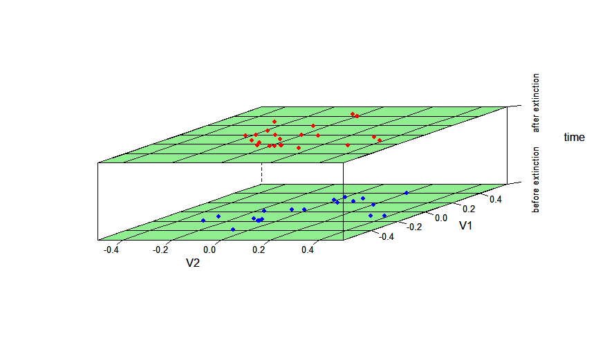
